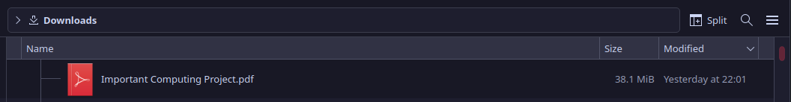

# ✂️📃 PDF Cutter

A Python tool that prepares massive documents for printing at school, by splitting them into 30-page chunks.

> 📖 PDF Cutter slices your PDFs for PaperCut

## Download

Clone the repository or download the source code from this GitHub repository.

On school computers, it's easiest to download [just the `main.py` file](https://github.com/RandomSearch18/pdf-cutter/raw/refs/heads/main/main.py).

You then need to install the `pypdf` package, e.g.

```powershell
py -m pip install pypdf
```

## Run

Use Python to run `main.py`, providing it the path to your PDF file. For example, on Windows:

```powershell
py main.py "H:\Downloads\Big document.pdf"
```

The program will take the PDF file you have provided, split it into a number of "chunks" of up to 30 pages each, and save them as new PDF files in a subfolder within the folder where the main PDF file is.

In this example, the PDF chunk files would be saved in `H:\Downloads\Big document (PDF cutter)\`. See the screenshots below for another example.

### Alternative: running with `uv`

If you have the [`uv` tool](https://github.com/astral-sh/uv) installed, you can run the program directly, without having to manually install the `pypdf` package.

```bash
uv run main.py
```

## Screenshots




## Acknowledgements

### Resources used

- [Tim Golden's Python Stuff: Print](https://timgolden.me.uk/python/win32_how_do_i/print.html)
- [Answer: Print to standard printer from Python?](https://stackoverflow.com/a/22550163/11519302)
